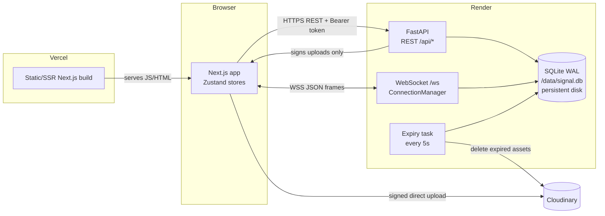
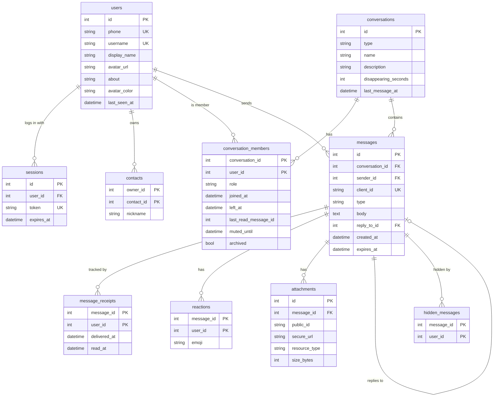

# Signal Clone

A functional clone of **Signal Desktop**: real-time 1:1 and group messaging with delivery/read receipts, typing indicators, presence, replies, reactions, photo/video/file attachments, and disappearing messages. The responsive UI is tuned against reference screenshots of Signal Desktop in light and dark themes, and uses the official Signal logo and wordmark.

- **Frontend:** Next.js 16 (App Router) · TypeScript · Tailwind CSS v4 · Zustand, deployed on **Vercel**
- **Backend:** FastAPI · SQLAlchemy 2.0 · Alembic · SQLite (WAL) · native WebSockets, deployed on **Render**
- **Files:** Cloudinary (signed direct uploads from the browser; signed, expiring download links for files)

## Live demo

| | URL |
|---|---|
| App (Vercel) | `https://<your-app>.vercel.app` ← _fill in after deploying_ |
| API (Render) | `https://<your-api>.onrender.com/api/health` |

### Demo accounts

Every account uses the verification code **`123456`** (the OTP is mocked and set by the `FIXED_OTP` env var; `123456` is the value in `.env.example`). The login screen also has one-click buttons for the first three.

| Phone | Name | Good for |
|---|---|---|
| +91 98000 00001 | Aarav Sharma | Main demo user: 6 DMs, 3 groups, unread chats |
| +91 98000 00002 | Priya Patel | Second browser for real-time tests (DM with Aarav) |
| +91 98000 00003 | Rohan Mehta | Admin of "Bangalore Foodies" |
| +91 98000 00004 … 10 | Ananya, Vikram, Sara, Emily, Lucas, Mei Lin, Diego | |

Any other number creates a new account and goes through profile setup.

## Features

### Core
- [x] Phone number + OTP login, profile setup (name + photo or initials), session persists across refresh, logout
- [x] Three-column Signal Desktop layout: nav rail (hamburger, Chats/Calls/Stories, Settings and profile at the bottom), conversation list, chat pane, plus the welcome state. The hamburger collapses the list to an avatar column
- [x] Responsive: 3 columns at ≥1024px, narrower list at 768–1023px, single-screen navigation with a back button and bottom tab bar below 768px
- [x] Conversation list sorted by activity, with two-line previews ("You:", "📷 Photo", "🎥 Video", "📎 File", "typing…"), relative times, unread pills, muted icon, and delivery ticks; a "…" menu for New group, Archived chats and Keyboard shortcuts
- [x] Search across chats, contacts, and every user on the server; new chat by contact, phone number, or @username
- [x] Contacts: **Add contact** dialog (phone with country code, or @username, plus an optional nickname, then "Add" or "Add & message"), an **Add** button on people found in search, and Add to / Remove from contacts in a direct chat's settings
- [x] Real-time 1:1 messaging over WebSockets, with optimistic sending and server acks
- [x] Message status: sending (clock) → sent (✓) → delivered (✓✓) → read (filled ✓✓), derived from receipts
- [x] Typing indicators (animated bubble + "typing…" in the list), online / last-seen presence
- [x] Infinite scroll up (cursor pagination), smart auto-scroll, "new messages" jump button
- [x] Groups: create (members → name + photo), admins, add/remove members, make/remove admin, leave, system messages, server-side permission checks; removed members keep their history but stop receiving
- [x] Light, dark, and system themes (token swap via CSS variables). The surface, bubble and text colours were sampled from Signal Desktop screenshots, and group sender names have separate light and dark palettes for contrast

### Bonus
- [x] **Reply / quote**: from the hover action or the context menu, with a preview above the composer. Clicking the quote scrolls to the original (loading older pages if needed) and highlights it
- [x] **Reactions**: hover bar with 6 defaults + emoji picker, one reaction per user, pills with counts, live updates
- [x] **Attachments**: + button, drag-and-drop, or paste. Signed direct upload to Cloudinary with a live preview and progress in the bubble. Uploads are typed by kind:
  - **Images** (`image`) open in a lightbox.
  - **Videos** (`video`: mp4, webm, mov, mkv, …) play inline with controls.
  - **Other files** (`raw`) show as a Signal-style card (page icon with the extension, name, size) and download through a short-lived signed link.
  - Upload errors show Cloudinary's own message.
- [x] **Disappearing messages**: Off/30s/5m/1h/1d/1w. A system message announces each change, a timer icon shows in bubbles, and a server task deletes expired messages (and their Cloudinary files) every 5s, pushing `message.expired` to clients
- [x] **Context menu**: reply, react, copy, message info (per-recipient delivered/read times), delete for me, retry failed sends
- [x] **Settings**: Profile, Appearance, Chats (Enter to send, spell check), Notifications (browser Notification API, sound, content privacy), Privacy (read receipts and typing indicators, both reciprocal like Signal), Linked devices (coming soon), Help
- [x] "View safety number" (60 digits, explains that the encryption is simulated), mute (1h … always), archive
- [x] **Search in chat** (header search icon): matches the messages already loaded in the chat. Enter/↓ steps to older matches and ↑ to newer ones, scrolling to each match and highlighting it
- [x] Signal Desktop chrome:
  - A borderless chat header with video, voice (direct chats only), search and "…" buttons.
  - A composer with emoji on the left, a pill-shaped message box, then sticker, mic/send and +.
  - In groups, the sender's avatar sits beside the last message of a run.
  - System messages show an icon (timer, member added/removed, edit).
- [x] Keyboard shortcuts: `Ctrl/⌘+K` search, `Ctrl/⌘+N` new chat, `Alt+↑/↓` switch chat, `Esc` close, `Ctrl/⌘+/` help
- [x] Loading skeletons, "Connecting…" banner, aria labels, visible focus states, reduced-motion support
- [x] Calls and Stories tabs as "coming soon" pages

## Architecture



The browser loads the app from Vercel and then talks to Render directly: REST for reads and writes, one WebSocket per tab for live events. File bytes go straight from the browser to Cloudinary using a short-lived signature from our API, and SQLite stores only the metadata. Non-image files are downloaded through a signed link that expires after 5 minutes, issued only to members of the conversation.

### Backend layout

```
backend/app/
  main.py          app factory, CORS, routers; startup runs migrations, seeds an empty DB, starts the expiry loop
  config.py        settings from env (pydantic-settings)
  db.py            engine (WAL + foreign_keys pragmas), session dependency
  deps.py          get_db, get_current_user (Bearer token)
  models/          one SQLAlchemy model per table (typed Mapped[])
  schemas/         Pydantic request/response models
  routers/         thin HTTP layer
  services/        all business logic (auth, users, contacts, conversations, messages, queries, Cloudinary, presenters)
  ws/manager.py    ConnectionManager: dict[user_id, set[WebSocket]]
  ws/events.py     event names + payload models
  ws/handlers.py   /ws endpoint and client-event dispatch
  ws/broadcast.py  "after commit, push to these users" helpers
  tasks/expiry.py  disappearing-messages loop
```

### Frontend layout

```
frontend/src/
  app/                    routes: /login, /(app)/chats, /chats/[id], /calls, /stories, /settings
  components/chat/        ChatPane, ChatHeader, ChatSearchBar, MessageList, MessageBubble, Composer, details panel, modals
  components/chats/       ConversationList, rows, new chat / new group / add contact
  components/shell/       nav rail + bottom tabs, connection banner, shortcuts
  components/ui/          Avatar, Menu, Modal, Toasts, controls, SignalBrand (official logo + wordmark paths)
  store/                  Zustand: auth, chat (conversations/messages/typing/presence/outbox), ui, settings
  lib/api.ts, lib/ws.ts   fetch wrapper; WebSocket client with backoff + ping
  lib/chatActions.ts      send / retry / mark read / typing / contacts
  lib/upload.ts           signed Cloudinary upload with progress
  hooks/useRealtime.ts    routes every server event into the stores
```

## Data model



| Table | Purpose |
|---|---|
| `users` | One row per phone number. `avatar_color` is a stable pastel used for the initials avatar. |
| `sessions` | Random bearer tokens with an expiry. Logout deletes the row. |
| `contacts` | One-directional address book (`owner` → `contact`) with an optional nickname. |
| `conversations` | Direct and group chats in **one table** (`type`). Only one direct chat per pair, enforced in `services/conversations.find_direct`. |
| `conversation_members` | Membership plus per-user state: role, read pointer, mute, archive. Leaving sets `left_at`; rows are never deleted, so history stays readable. |
| `messages` | Text, image, file, and system messages. `client_id` is **UNIQUE**, which makes sends idempotent. Index on `(conversation_id, created_at)`. |
| `message_receipts` | One row per (message, recipient), created at send time; `delivered_at`/`read_at` filled in later. |
| `reactions` | PK `(message_id, user_id)` ⇒ one reaction per user per message. |
| `attachments` | Cloudinary metadata only (public_id, URL, type, size, dimensions). No file bytes in the database. |
| `hidden_messages` | **Added to the given schema** for "delete for me", which is per-user state. |

All foreign keys declare `ON DELETE` behaviour (CASCADE for owned rows, SET NULL for `sender_id`/`reply_to_id`/`created_by`). SQLite enforces them via `PRAGMA foreign_keys=ON`.

**Derived, not stored:**
- **Message status**: `sent` once the row exists; `delivered`/`read` once *every current recipient's* receipt has that timestamp. Groups take the lowest state, and people who left are ignored.
- **Unread count**: messages with `id > last_read_message_id`, not sent by me, not system messages, inside my membership window.

## API

All REST endpoints are under `/api` and require `Authorization: Bearer <token>` except the auth ones and health.

| Method | Path | Description |
|---|---|---|
| POST | `/auth/request-otp` | `{phone}` → `{sent, is_new_user, hint}` |
| POST | `/auth/verify-otp` | `{phone, code}` → `{token, user, is_new_user}` (creates the user if new) |
| POST | `/auth/logout` | Delete the current session |
| GET | `/auth/me` | Current user |
| PATCH | `/users/me` | Update name, about, username, avatar |
| GET | `/users/search?q=` | Search by name, @username, or phone |
| GET / POST | `/contacts` | List contacts / add by `user_id`, `phone`, or `username` |
| DELETE | `/contacts/{id}` | Remove a contact |
| GET | `/conversations` | My conversations, sorted by `last_message_at`, with `unread_count` + `last_message` |
| POST | `/conversations` | `{type: "direct", user_id}` (get-or-create) or `{type: "group", name, member_ids}` |
| GET / PATCH | `/conversations/{id}` | Details / update name, description, photo, timer (admins) and mute/archive (me) |
| POST | `/conversations/{id}/read` | Move my read pointer **without** sending read receipts (receipts turned off) |
| POST | `/conversations/{id}/members` | Add members (admin) |
| DELETE | `/conversations/{id}/members/{user_id}` | Remove a member (admin) or leave (self) |
| PATCH | `/conversations/{id}/members/{user_id}` | `{role}`: make/remove admin (admin; 403 otherwise) |
| GET | `/conversations/{id}/messages?before=&limit=50` | Cursor pagination by message id, oldest first + `has_more` |
| POST | `/attachments/sign` | `{kind, mime_type, size_bytes}` → Cloudinary signature + `resource_type` (`image` / `video` / `raw`). Avatars: images ≤ 5 MB; attachments ≤ 25 MB |
| GET | `/attachments/{id}/download` | Short-lived signed download link (conversation members only). Works even though new Cloudinary accounts block public PDF/ZIP delivery |
| PUT / DELETE | `/messages/{id}/reactions` | Set / remove my reaction |
| GET | `/messages/{id}/info` | Per-recipient delivered/read times (sender only) |
| DELETE | `/messages/{id}` | Delete for me |
| GET | `/health` | Liveness check |

### WebSocket `/ws?token=…`

Frames are JSON `{"type": "...", "payload": {...}}`. An invalid token closes the socket with code **4401**.

| Direction | Event | Payload |
|---|---|---|
| → server | `message.send` | `{client_id, conversation_id, body, reply_to_id?, attachments?}` |
| → server | `typing.start` / `typing.stop` | `{conversation_id}` |
| → server | `receipt.delivered` / `receipt.read` | `{message_ids}` |
| → server | `ping` | `{}` (every 25s) |
| ← client | `message.ack` | `{client_id, message}`, sent to all of the sender's tabs |
| ← client | `message.new` | message (per-recipient copy) |
| ← client | `receipt.updated` | `{conversation_id, updates: [{message_id, status}]}`, sent to the sender |
| ← client | `typing` | `{conversation_id, user_id, is_typing}` (clients auto-expire after 5s) |
| ← client | `presence` | `{user_id, online, last_seen_at}` |
| ← client | `reaction.updated` | `{conversation_id, message_id, reactions}` |
| ← client | `conversation.updated` | full conversation, personalised per user |
| ← client | `member.updated` | `{conversation_id, member}` |
| ← client | `message.expired` | `{conversation_id, message_ids}` |
| ← client | `error` | `{code, message, client_id?}` |
| ← client | `pong` | `{}` |

## Life of a message

1. **Compose.** `Composer` calls `sendText()` (`lib/chatActions.ts`). It creates a `client_id` (UUID), adds an optimistic bubble with status `sending` (clock icon), and puts the payload in the store's **outbox**.
2. **Send.** `realtime.send("message.send", payload)`. If the socket is down, the payload stays in the outbox.
3. **Persist first.** `ws/handlers.dispatch` validates the payload (`MessageSend`) and calls `services/messages.send_message`. That function checks active membership, returns the existing row if this `client_id` was already stored (idempotency), and validates the reply target and attachment URLs. It then inserts the message, inserts one empty receipt per current recipient, sets `expires_at` if a timer is on, bumps `last_message_at`, moves the sender's read pointer, and **commits**.
4. **Ack + fan-out.** Only after the commit does `ws/broadcast.message_created` send `message.ack` to the sender's sockets, which replaces the optimistic bubble by `client_id` (status `sent`), and `message.new` to every other active member.
5. **Delivered.** The recipient's client handles `message.new` and immediately replies with `receipt.delivered`. Users who were offline are marked delivered when their socket connects. The server sets `delivered_at`, recomputes the derived status, and sends `receipt.updated` to the sender (✓✓).
6. **Read.** When the chat is open *and* the window is focused, `markConversationRead` sends `receipt.read` for the unread incoming ids. The server sets `read_at`, advances `last_read_message_id`, notifies the sender (filled ✓✓), and syncs the reader's other tabs via `conversation.updated`. With read receipts turned off, the client calls `POST /conversations/{id}/read` instead, which moves the pointer silently.
7. **Reconnect.** `lib/ws.ts` reconnects with exponential backoff (1s → 30s + jitter). On reopen, `useRealtime.resync` refetches conversations and the newest page of every loaded chat, then **resends the outbox**. The UNIQUE `client_id` guarantees no duplicates.
8. **Expire (optional).** If the conversation has a timer, `tasks/expiry.py` deletes the row after `expires_at` (receipts, reactions, and attachments cascade), deletes the Cloudinary files, and broadcasts `message.expired`.

## Repository layout

| Path | What it is |
|---|---|
| `backend/` | FastAPI app, Alembic migrations, seed script, tests, `Dockerfile` |
| `frontend/` | Next.js app (deployed to Vercel) |
| `frontend/assets/brand/` | The Signal brand SVGs the app is built from (logo/wordmark paths, tab icon) |
| `extras/` | Reference material that isn't part of the build: unused brand variants, design screenshots |
| `render.yaml` | Render Blueprint for the backend (Docker, persistent disk, health check, env vars) |
| `DEPLOY.md` | Step-by-step Render + Vercel deployment, verification and troubleshooting |
| `NOTES.md` | Screen-by-screen design notes and the interview briefing |
| `.env.example` | Every environment variable for both apps, with secrets blank |

## Local setup

**Prerequisites:** Python 3.11+ and Node 20+.

```bash
# 1. Backend  (http://localhost:8000)
cd backend
python -m venv .venv
# Windows: .venv\Scripts\activate    macOS/Linux: source .venv/bin/activate
pip install -r requirements-dev.txt   # runtime deps + pytest/ruff (production installs requirements.txt only)
cp .env.example .env            # required (FIXED_OTP); add Cloudinary keys to enable uploads
uvicorn app.main:app --reload --port 8000
# First start runs migrations and seeds demo data automatically.
# Reset the demo data at any time:  python seed.py --reset

# 2. Frontend  (http://localhost:3000)
cd frontend
npm install
cp .env.example .env.local
npm run dev
```

On Windows, `next.config.ts` sets `experimental.workerThreads: true`. Some terminals (IDE terminals, sandboxes) forbid the dev server from spawning child processes, which used to break opening a chat with *"Jest worker encountered 2 child process exceptions"*.

**Test real-time:** open http://localhost:3000 in a normal window and log in as **Aarav** (98000 00001). Open a second, private/incognito window and log in as **Priya** (98000 00002). Each window keeps its own localStorage, so you get two separate sessions. Open their chat on both sides and type: you should see the typing bubble, instant delivery, and the ticks moving to read.

**Checks:**

```bash
cd backend && pytest -q && ruff check .          # 31 tests
cd frontend && npx tsc --noEmit && npm run lint && npm run build
```

## Environment variables

### Backend (`backend/.env`)

| Variable | Default | Description |
|---|---|---|
| `DATABASE_URL` | `sqlite:///./signal.db` | On Render: `sqlite:////data/signal.db` (four slashes = absolute path on the persistent disk) |
| `CORS_ORIGINS` | `http://localhost:3000` | Comma-separated exact origins, no trailing slash |
| `CLOUDINARY_CLOUD_NAME` | _(empty)_ | Uploads return 503 until these three are set |
| `CLOUDINARY_API_KEY` | _(empty)_ | |
| `CLOUDINARY_API_SECRET` | _(empty)_ | Never sent to the browser |
| `FIXED_OTP` | **required** | Mocked 6-digit login code. The server refuses to start without it |
| `SESSION_DAYS` | `30` | Session lifetime |
| `AUTO_SEED` | `true` | Seed demo data when the users table is empty |

### Frontend (`frontend/.env.local`, or Vercel project settings)

| Variable | Example | Description |
|---|---|---|
| `NEXT_PUBLIC_API_URL` | `http://localhost:8000` | Backend base URL (no `/api`, no trailing slash) |
| `NEXT_PUBLIC_WS_URL` | `ws://localhost:8000/ws` | **`wss://…/ws` in production** |
| `NEXT_PUBLIC_DEMO_OTP` | `123456` | Optional login-screen hint (must match `FIXED_OTP`); empty hides it |

`NEXT_PUBLIC_*` values are baked into the public JS bundle at build time: never put secrets in them, and redeploy after changing them.

A root [`.env.example`](.env.example) lists every variable for both apps in one place. Secrets (Cloudinary keys, `FIXED_OTP`) are read only from the environment; `.env` files are gitignored.

## Deployment

Full step-by-step guide: **[DEPLOY.md](DEPLOY.md)**. It covers Render and Vercel setup, CORS, verification and troubleshooting. In short:

1. **Render** (backend): a Docker web service from the [`render.yaml`](render.yaml) Blueprint (root `backend`, `/api/health` check), on a paid instance (Starter) with a persistent disk at `/data`, plus `DATABASE_URL=sqlite:////data/signal.db`, the Cloudinary keys and `FIXED_OTP`. Run **one instance**, because WebSocket connections live in memory.
2. **Vercel** (frontend): root directory `frontend`, `NEXT_PUBLIC_API_URL=https://<api>`, `NEXT_PUBLIC_WS_URL=wss://<api>/ws`.
3. Put the Vercel URL into Render's `CORS_ORIGINS`, then verify: `/api/health`, a WebSocket with status 101 plus ping/pong in DevTools, and a two-browser chat.

On Render's **free** plan there is no persistent disk: the SQLite file is reset (and re-seeded) on every deploy or restart, and the service sleeps after 15 minutes idle. Fine for a quick look, but use Starter for a demo that keeps its data.

## Assumptions and simplifications

- **Mocked OTP:** no SMS provider. Every number accepts the code in `FIXED_OTP` (`123456` in the examples).
- **Simulated encryption:** messages travel over TLS (HTTPS/WSS) but are stored in plain text on the server. The lock notice and safety number are UI only; the safety number is a SHA-512 of both user ids.
- **Single-instance WebSocket manager:** connections live in one process's memory, so the backend must run as one replica.
- **Public Cloudinary URLs for images and videos:** they are shown from their public `secure_url`. Other files (PDFs etc.) are downloaded through a 5-minute signed link from `/attachments/{id}/download`, after a membership check.
- **Disappearing timer starts on send**, whereas Signal starts it when each recipient *reads* the message.
- Delete is "for me" only (no delete-for-everyone or edit). Voice/video calls, stories, stickers, voice messages and linked devices are placeholders ("coming soon").
- In-chat search only looks at messages already loaded in the browser (scroll up to load more); there is no server-side search.
- Contacts are one-directional, and anyone can message any registered user (no message requests or blocking).
- The logo and wordmark are Signal's official brand files (`frontend/assets/brand/`), used here for a non-commercial clone. Signal's name and logo are trademarks of the Signal Technology Foundation.
- Database calls inside async WebSocket/REST handlers are synchronous. With SQLite they take well under a millisecond, which keeps the code simple.

## Production improvements

- **Redis pub/sub** (or NATS) between app instances so WebSocket fan-out works across replicas; move presence into Redis with TTLs.
- **Postgres** instead of SQLite for concurrent writers, plus `async` SQLAlchemy, connection pooling, and point-in-time backups.
- **Authenticated Cloudinary delivery for images and videos too** (files already use signed, expiring links), virus scanning, and per-user upload quotas.
- **Real end-to-end encryption** with the Signal Protocol (X3DH + Double Ratchet via libsignal), so the server only stores ciphertext.
- Real OTP via an SMS provider with rate limiting, and refresh tokens / device-bound sessions.
- A durable outbox (IndexedDB) so unsent messages survive a page reload; web push for offline notifications.
- Server-side message search (SQLite FTS5 / Postgres full-text) across all history, edit and delete-for-everyone, message requests and blocking, voice messages.
